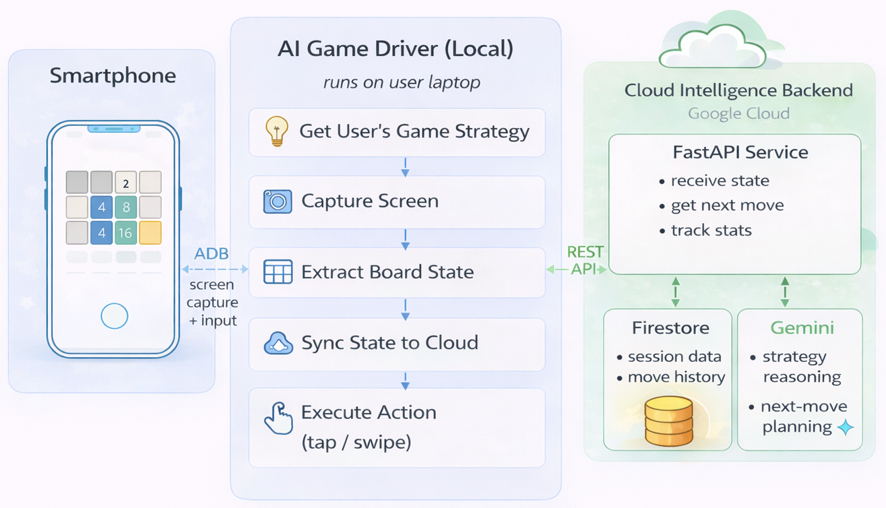

# Play My Strategy: User-Defined Strategy, AI-Driven Execution

---



## Overview

Every game, at its core, asks two essentials of the player: **strategy** and **perception**.

Strategy is the mind — knowing when to play aggressively, when to hold back, when to pursue a high-risk reward, and when to protect long-term position. It reflects the player’s judgment, style, and intent. Perception is the bridge between intention and action — the ability to interpret visual information quickly, respond to changes in real time, and translate decisions into precise physical input.

For many people, these two capacities work together almost effortlessly. But for millions of players living with **Parkinson's disease**, **essential tremors**, or **low vision**, perception becomes the wall that strategy can never climb over. The mind remains sharp, the ideas are present, and the desire to play is intact — yet executing precise movements, reacting quickly, or interpreting visual information clearly may become difficult or even impossible. The joy of gaming, and the cognitive stimulation it brings, becomes less accessible not because of *how someone thinks*, but because of *how their body responds*.

**This project exists to tear that wall down.**

The idea is: **you bring the strategy, the AI brings the execution**. You describe how you want to play — in plain language, in your own words, as detailed or as simple as you like. The system reads the game state, understands the current situation, applies your strategy, and plays on your behalf. You stay in control of the *how*. The machine handles the *doing*.

This is not about replacing human players with bots. It is about giving people whose hands shake, whose vision blurs, or whose fine motor skills have changed — the same ability to *play their own game* that everyone else takes for granted.

---

## Example: 2048

To demonstrate this concept in action, we built a working implementation around one of the most popular and beloved casual games: **2048**.

2048 is a strong test case — it is a strategy-driven game with a clear 4×4 grid and a rich set of tactical choices, such as corner anchoring, merge chaining, and tile management. At the same time, it requires continuous visual interpretation and precise swipe inputs, which are exactly the barriers this system is designed to address.

In this system:

- A local game driver runs on your computer, connects to an Android phone, and interacts with the device through ADB.
- A cloud API, hosted on Google Cloud Run, receives the current game state together with your strategy input.
- The API uses the Google Gemini API to reason about the next action according to your instructions and current game status.
- Google Firestore provides persistent cloud-side storage for lightweight session tracking and state management.
- The local game driver continuously applies the returned actions on your behalf, so you can monitor the game, refine your strategy at any time, and let the system handle the execution.


---

## Step 1: Setting Up the Cloud API

The API is a FastAPI service deployed on Google Cloud Run that uses Google Gemini to plan moves. It also includes a browser-based Playground, allowing users to quickly try the system without running local code or connecting to an Android phone.

### Cloud API

- Publicly accessible REST endpoints that the local game driver, or any compatible client, can call
- A `/playground` web page where users can try different strategies and board states directly in the browser — no phone, no ADB, and no local setup required
- Move planning powered by **Google Gemini**, exposed through a lightweight **FastAPI** service
- Deployment on **Google Cloud Run**, so the backend can be hosted without managing your own server
- Session tracking through **Firestore**, so each game run can be logged with its move history
- A built-in rate-limiting option to help protect your API quota
- A centralized backend that lets you update prompts, planning logic, and service behavior in one place without modifying the local game driver

### Prerequisites

Before deploying the Cloud API, make sure you have:

- A **Google Cloud project**
- The **Google Cloud SDK (`gcloud`)** installed and authenticated
- A **Gemini API key** from **Google AI Studio**
- A **Firestore** database created in your Google Cloud project for session and usage tracking
- Permission to deploy services and manage runtime configuration in your Google Cloud project

### Deploying the Cloud API

The backend is designed for direct deployment to **Google Cloud Run** using the provided `cloudbuild.yaml`. In a typical setup, the API can be deployed with a single build command. The provided configuration also supports managing the **Gemini API key** through **Google Secret Manager**, which improves security by keeping sensitive credentials out of the build file. If preferred, you may also provide the raw key directly through runtime configuration, though Secret Manager is the recommended approach. If any access-related setting needs adjustment after deployment, it can be updated through the Cloud Run console.

From the `api/` directory, run:

```bash
gcloud builds submit \
  --config=cloudbuild.yaml \
  --substitutions=_SERVICE_NAME=YOUR_SERVICE_NAME,_REGION=YOUR_REGION
```


### API endpoints

| Method | Path | Description |
|--------|------|-------------|
| `GET` | `/healthz` | Health check |
| `GET` | `/playground` | Browser-based board playground |
| `GET` | `/nextSessionId` | Get a new session ID for a device |
| `GET` | `/getStats` | Fetch session move statistics |
| `POST` | `/syncState` | Upload current board + strategy |
| `POST` | `/getNextMove` | Get Gemini's recommended move |
| `POST` | `/extractBannerStats` |  Extract summary statistics from the completed game session |
| `POST` | `/playground/api/step` | Single-step from playground UI |

---

## Step 2: Setting Up the Local Game Driver

The local game driver runs on your computer and serves as the execution side of the system. It connects to the Android device through **ADB**, captures the current game screen, extracts the relevant state, sends that information together with your strategy to the cloud API, receives the next action, and executes it automatically on the Android device.

### Local Game Driver

- A Gradio-based local interface for controlling the system from your browser
- A live **strategy input panel** where you can express, refine, and update how you want the system to play
- Optional **voice input** so you can provide your strategy in natural language without relying on typing
- Direct **ADB-based** device control for screen capture and action execution
- Continuous synchronization with the **Cloud API** for AI-driven move planning
- A real-time **status and move log** for monitoring system behavior
- A **step mode** for inspecting one action at a time
- A fallback random action to keep the game moving if a Gemini decision causes the game to stall


### Prerequisites

Before running the local game driver, make sure you have:

- An **Android device** with **USB debugging** enabled
- **ADB (Android Debug Bridge)** installed and available on your system
- The deployed **Cloud API URL**
- The required local Python dependencies installed from this repository (`local/requirements.txt`)


### Running the Local Game Driver

Connect your Android phone through **ADB**, and make sure the target game is open on screen. Then start the local game driver from the `local/` directory:

```bash
python main.py --adb-path "C:\path\to\adb.exe" --api-url "https://SERVICE_NAME-PROJECT_NUMBER.REGION.run.app"
```

After launch, open the local Gradio interface in your browser (typically `http://127.0.0.1:7860`).

From there, you can:

- Enter your strategy in the text box, using plain language to describe how you want the system to play
- Optionally use voice input to dictate your strategy instead of typing
- Click Start to begin autonomous play
- Click Pause to stop between moves, or Step to advance one move at a time
- Monitor the live log panel to see the parsed state, planned actions, and executed moves


### Adjusting crop coordinates

The default crop coordinates are configured for a common 1080p Android layout (Pixel 6a). If your device uses a different screen resolution or game layout, update the crop coordinate variables in `local/core.py`, such as `CROP_Y*` and `CROP_X*`, to adjust the capture region accordingly.

---

## Sample Strategies to Get You Started

The AI follows your instructions — so the quality of your strategy text directly affects performance. Here are a few examples to try:

**Conservative corner strategy:**
> *"Always keep the highest tile in the bottom-right corner. Prioritize right and down swipes. Never swipe left unless absolutely necessary. Merge tiles towards the bottom row first."*

**Aggressive merge strategy:**
> *"Chase the largest possible merge on every move. Prefer moves that combine the most tiles in a single swipe. Keep the board as empty as possible."*

**Balanced play:**
> *"Try to maintain a snake pattern from bottom-left to bottom-right across the bottom two rows. Avoid swipes that scatter large tiles to the edges."*

---

## Project Structure

```
.
├── api/                        # Cloud API (deploy to Google Cloud Run)
│   ├── app/
│   │   ├── main.py             # FastAPI routes
│   │   ├── gemini.py           # Gemini move planner
│   │   ├── models.py           # Pydantic request/response models
│   │   ├── store.py            # Firestore session store
│   │   ├── playground.py       # Browser playground builder
│   │   └── static/             # Sample board images for playground
│   ├── Dockerfile
│   ├── cloudbuild.yaml
│   └── requirements.txt
│
└── local/                      # Local driver (runs on your PC)
    ├── main.py                 # Entry point (CLI args)
    ├── core.py                 # ADB loop, Gemini sync, swipe logic
    ├── gui.py                  # Gradio UI
    ├── icon/
    └── demo/                   # Sample screenshots for testing
```

---

